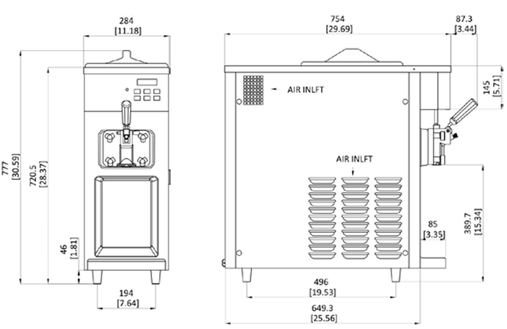

# Soft Serve Machine — 6210-C
**110V – Gravity Feed**

  

- Single Flavor // Countertop
- Digital Control
- Up to 120, 4oz servings per hour
- 1.3 Qt Cylinder – 8.5 Qt Hopper

> **Ideal for any business with limited counter space to add ice cream, frozen yogurt, gelato or sorbet. Flexible with digital control and display. Great fit for restaurants, bars, kitchens, convenience stores and delis.**

---

## Gravity Feed

The Spaceman gravity-fed machines produce consistent product quality with a solution that is easy to operate and easier to clean with less moving parts.

---

## Key Features

**Fast Freeze Down**
Patented high efficiency heat exchanger allows fast freeze down with low energy consumption.

**Patented 100% Controlled Contact Flooded Evaporator**
Designed for maximum efficiency, this innovation delivers the industry's fastest freeze-down and recovery times. The result? Smaller ice crystals and the smoothest, creamiest mouthfeel.

**Smart Safety Controls & Standby Mode**
Independently set and control standby temperatures for the hopper and freezing cylinder, optimizing energy efficiency and product quality during non-use. Maintains product temperature in both mix hopper and freezing cylinder below 4.4ºC (40ºF) overnight.

**Reduced Parts**
Reduced parts improve cleaning time and operational experience.

**Defrost for Cleaning**
Increases efficiency during cleaning by heating frozen product in cylinder.

**V5 Single-Piece Auger Design**
A fully integrated auger eliminates parts, reduces cleaning time and failure points in the drivetrain, ensures 100% evaporator wall contact, and enhances product consistency with the smallest ice crystals and smoothest mouthfeel in the industry.

**Dual-System Gravity-Fed Air Inlet**
Combined with the V5 auger, this system optimizes overrun and product consistency, delivering the best long-term texture and quality in the industry.

---

## The Spaceman Difference

### Quality — Superior Craftsmanship
*Designed by Aerospace Engineers*
- Patented Freezing Cylinder
- Built to last, attention to detail
- Microcrystal Technology

### Value — Maximum ROI
*Lower Your Cost of Ownership*
- Fair up front cost
- Lower service and parts costs
- Lowest energy cost per serving

### Service — Best User Experience
*Service on Your Terms*
- Dedicated Success Team
- No binding contracts
- No locked-in maintenance fees

---

## Specifications

| Specification | Value |
|---|---|
| Flavors | 1 |
| Freezing Cylinders | 1 x 1.2L / 1.3 Qt |
| Mix Hoppers | 1 x 8L / 8.5 Qt |
| Output Capacity (4oz servings) | 120 serves/hr |
| Max Serving Size | 8oz |
| Clearance Requirements | 152mm / 6" on back |

### Weight

| | Kg / lb |
|---|---|
| Net | 88 / 194 |
| Shipping | 100 / 220 |
| Volume | 0.3 CBM / 10 CBF |

### Dimensions

| Dimension | Net (mm/in) | Shipping (mm/in) |
|---|---|---|
| Width | 284 / 11 | 380 / 15 |
| Depth | 754 / 30 | 840 / 33 |
| Height | 778 / 31 | 930 / 37 |

### Electrical

| Electrical | Power (kW) | Total Amps (A) | Plug |
|---|---|---|---|
| 110–115/60/1 | 1.8 | 16 | 5-20P |

---

## Features

| Feature | Included |
|---|---|
| Control System | Single, Digital |
| Refrigerated Hopper | ✓ |
| Temperature Display | ✓ |
| Standby Mode | ✓ |
| Auto Closing Dispensing Valve | ✓ |
| Dispensing Speed Control | ✓ |
| Low Mix Indicator Light & Alarm | ✓ |
| Low Temperature Protection | ✓ |
| Motor Overload Protection | ✓ |
| High Pressure Protection | ✓ |
| Defrost & Quick Freeze | ✓ |

---

## Available Options

| Option | Available |
|---|---|
| Cart (Trolley) | ✓ |

---

*Above specifications are subject to change without notice.*

**Contact:** 720-328-1020 / sales@spacemanusa.com / www.spacemanusa.com